# Data Claude - BigQuery Analysis Automation

An automated data analysis pipeline using Claude Code agents to explore, analyze, and visualize BigQuery data.

## Overview

This project provides a multi-agent workflow for:
1. **Initial Analysis** - Discover relevant tables, run exploratory SQL queries, generate executive reports
2. **Advanced Analysis** - Deep-dive with cross-table joins, cohort comparisons, and advanced analytics
3. **Visual Reporting** - Interactive React dashboards with charts powered by Tremor

## Setup

### 1. Configure Your GCP Project and Dataset

Set environment variables for your BigQuery project and dataset:

```bash
# Required: Set these before running the workflow
export BQ_PROJECT=your-gcp-project-id
export BQ_DATASET=your_dataset_name
```

**Example configurations:**

```bash
# Public Stack Overflow dataset (free, great for testing)
export BQ_PROJECT=bigquery-public-data
export BQ_DATASET=stackoverflow

# Public Google Analytics sample
export BQ_PROJECT=bigquery-public-data
export BQ_DATASET=ga4_obfuscated_sample_ecommerce

# Your own dataset
export BQ_PROJECT=my-company-analytics
export BQ_DATASET=warehouse
```

**Tip:** Add these exports to your `.bashrc` or `.zshrc` for persistence.

### 2. Source the BigQuery Aliases

The `.bq_aliases` file contains helpful BigQuery CLI shortcuts. Source it before running:

```bash
source .bq_aliases
```

### 3. Authenticate with GCP

Ensure you have valid GCP credentials:

```bash
gcloud auth application-default login
```

### 4. Install Dependencies

```bash
cd report-template && npm install
```

## Directory Structure

```
data-claude/
├── .claude/
│   ├── agents/           # 8 specialized agent definitions
│   │   ├── table-finder.md      # Finds relevant tables
│   │   ├── table-reader.md              # Analyzes individual tables
│   │   ├── table-reporter.md            # Generates table visualizations
│   │   ├── report-orchestrator.md
│   │   ├── chart-qa.md                  # Visual QA for charts
│   │   ├── advanced-analyzer.md         # Multi-table analysis
│   │   ├── advanced-table-report.md
│   │   └── advanced-report-orchestrator.md
│   └── commands/         # 4 user-invocable commands
│       ├── initial-analysis.md          # Entry point for analysis
│       ├── advanced-analysis.md         # Deep-dive analysis
│       └── table-reader.md
├── report-template/      # React + Tremor visualization app
├── python/
│   └── analyze_csv.py    # Statistical CSV analysis utility
├── research/             # Working directories (gitignored)
└── Makefile
```

## Usage

### Running Claude Code

From the data-claude directory:
```bash
cd data-claude && claude
```

### Initial Analysis

Ask a data question:
```
/initial-analysis

What is the retention rate for users who performed action X vs those who didn't?
```

This will:
1. Find relevant BigQuery tables
2. Run exploratory SQL queries
3. Generate CSV results with statistical analysis
4. Build an interactive report at http://localhost:8000

### Advanced Analysis

After initial analysis completes:
```
/advanced-analysis
```

This extends initial findings with:
- Cross-table joins
- Cohort comparisons
- Funnel analysis
- Opportunity sizing

## Dependencies

- **BigQuery access** - Via GCloud credentials
- **.bq_aliases** - BigQuery CLI shortcuts (included in this folder). Source it before running:
  ```bash
  source .bq_aliases
  ```
- **Node.js 18+** - For the report-template React app
- **Playwright** - For chart screenshot capture (installed via npm)

## Report Template

The visualization dashboard uses:
- React 18 + TypeScript
- Tremor charts (area, line, bar, donut)
- Tailwind CSS
- Vite for fast development

Start the dev server:
```bash
cd report-template && npm install && npm run dev -- --host 0.0.0.0 --port 8000
```

## Agent Architecture

The system uses parallel agent execution for efficiency:
- Agents run independently with their own context budgets
- Results are written to files, main session reads summaries
- Enables analyzing 15-20 tables per session

```mermaid
flowchart LR
    subgraph init["/initial-analysis"]
        D["🤖 table-finder"] --> E1["🤖 table-reader 1"]
        D --> E2["🤖 table-reader 2"]
        D --> E3["🤖 table-reader N"]
        E1 --> F["📄 initial-analysis.md"]
        E2 --> F
        E3 --> F
        F --> G1["🤖 table-report 1"]
        F --> G2["🤖 table-report 2"]
        F --> G3["🤖 table-report N"]
        G1 --> H["🤖 initial-report-orchestrator"]
        G2 --> H
        G3 --> H
        H --> J["🌐 localhost:8000"]
        J --> I1["🤖 chart-qa 1"]
        J --> I2["🤖 chart-qa 2"]
        J --> I3["🤖 chart-qa N"]
        I1 --> K["🌐 localhost:8000"]
        I2 --> K
        I3 --> K
    end
```



See individual agent files in `.claude/agents/` for detailed documentation.
